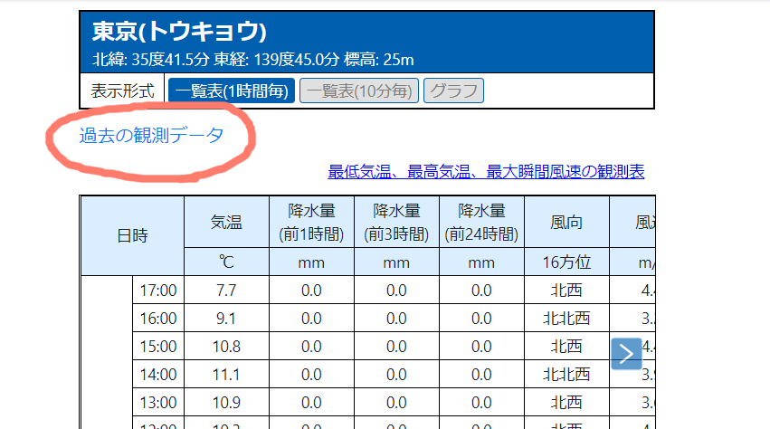

# 拡張機能「AmedasLink」

気象庁のアメダス(表形式)のページ[(例・東京)](https://www.jma.go.jp/bosai/amedas/#amdno=44132&area_type=offices&area_code=130000&format=table1h&elems=53614)に、過去の気象データ検索へのリンクを表示します。

[Chrome ウェブストア](https://chrome.google.com/webstore/detail/%E3%82%A2%E3%83%A1%E3%83%89%E3%82%B9/kmbellanocphagkgnbgkeoopdflhnbdo)

グラフの上に過去の観測データへのリンクを表示します。既に観測地点と昨日の日付が選択済みです。

# Tampermonkey

https://greasyfork.org/en/scripts/422808-amedaslink

# 更新履歴

2021/12/17 ver1.1.1 SPAでのページ遷移を検出していなかったことによるバグ修正。あとリファクタリング。

2021/2/24 ver1.1.0 気象庁HPのデザイン変更に伴ってグラフ機能を廃止
